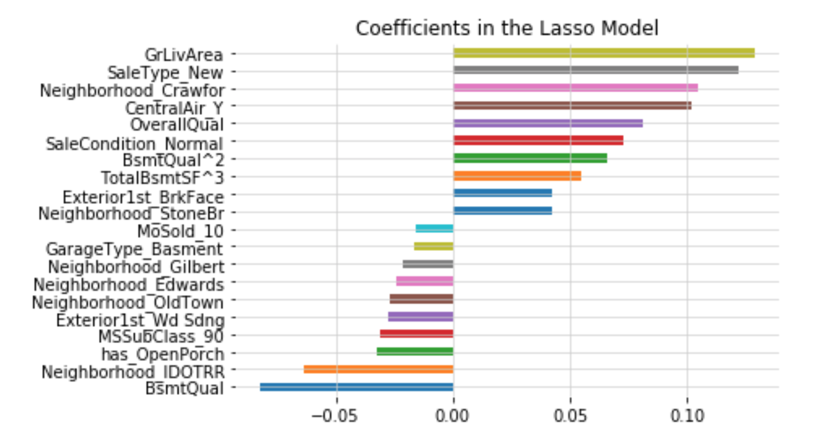
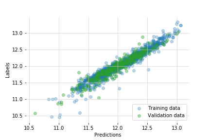
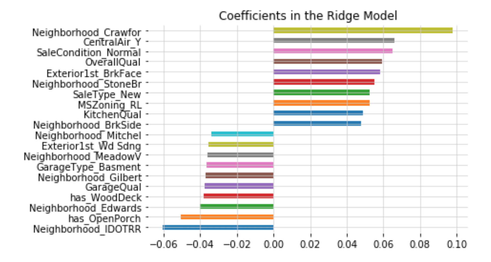

Ames Housing Prices
==============================

This is my analysis of the Ames housing dataset from the Kaggle competition. The analysis involves data cleaning and machine learning analysis. Best performing models include linear regression with ridge and lasso regulation. Decision tree, random forest and xgboost were also tested. 

Submitted rmse = 0.128

Goals for this project
------------

To show an example of analysis in Python (Python 3) on the Ames dataset. 
Jupyter notebooks (located in notebooks) were used for initial data exploration, model comparisions, and visualizations. 

Visuals:
----------

Comparison of lasso predicted vs actual for test and validation set

Comparison of the important lasso coefficients

Comparison of ridge predicted vs actual for test and validation set

Comparison of the important ridge coefficients

Further work to improve model:
----------

- Needs better outlier elimination
- Look into better modeling of non-linear coefficients
- Possibly use interaction terms and higher order terms
- Test different feature combinations

Further work to improve algorithms:
----------
- scripts not well optimized and will not scale well without major modifications to code
- was built as a 'one off' project
- vast improvements can be made with sklearn pipelines
- clunky use of column names...
